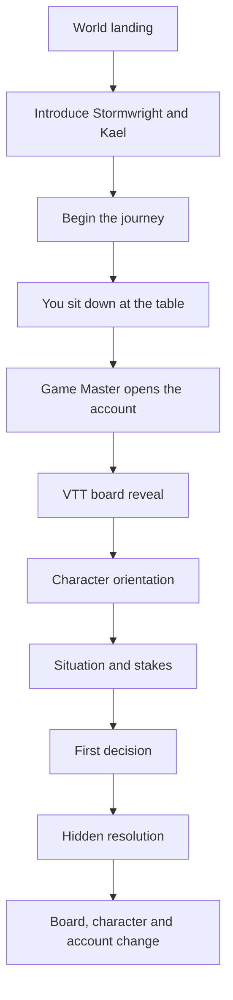

# Vallum Tabletop Experience Blueprint

## Product intent

Vallum is a solo-first digital tabletop experience designed to recreate the emotional structure of sitting around a kitchen table with a Game Master, a physical map, character sheets, tokens and a shared story.

The product must not feel like a dashboard, a branching web page or a conventional CRPG. It should feel like the player has sat down at a table and entered a living campaign.

## Core experience metaphor

The screen represents a tabletop scene:

- a physical table surface frames the experience;
- a VTT board or scene map sits at the centre;
- the Game Master is present behind a screen or book and reveals only what the player should know;
- the lead character is represented by a dimensional tabletop token;
- character sheets and the campaign account sit beside the board;
- choices are presented as spoken or written prompts from the Game Master;
- hidden calculations remain behind the screen;
- consequences alter the board, the character and the campaign account.

## Opening journey

The opening must establish immersion before presenting a decision.

### 1. World landing

The landing page introduces:

- The Stormwright Cycle;
- the Compact Lands and Eastern Marches;
- the central moral question;
- Kael Vorn and the meaning of the Iron Captain name;
- the module title and tone;
- the fact that the player is about to sit down at a virtual table.

The page should not expose engine, release, recovery or technical terminology.

### 2. Sit-down transition

After the player begins, the product should stage a short transition:

> You take your place at the table. The board has already been laid out. Rain moves across the eastern road. The Game Master opens the account and begins.

This transition establishes the table metaphor and separates product entry from scene entry.

### 3. Character orientation

Before the first choice, the player must understand:

- who Kael is;
- what he is known for;
- what he notices;
- what he fears becoming;
- what the player controls;
- what the Game Master controls.

### 4. Scene reveal

The Game Master reveals the board, location, immediate pressure and available actions. The player should understand the situation without reading technical state.

## Table composition

| Zone | Purpose | Required content |
|---|---|---|
| Table surface | Physical and emotional frame | wood, slate or dark table texture; vignette; lighting |
| VTT board | Main playable space | scene background, zones, terrain, tokens, overlays |
| Game Master position | Narration and controlled information | situation, stakes, choices, latest consequence |
| Character position | Player identity and persistence | portrait/token, HP, current condition, compact moral portrait |
| Account position | Memory and continuity | decisions, omissions, consequences, forward hooks |
| Utility position | Product controls | save, new session, music; visually subordinate |

## VTT board model

Every playable scene or coherent scene cluster should have a board definition.

A board contains:

- a background image or coded fallback;
- named zones;
- token anchors;
- points of interest;
- optional overlays such as rain, fire, smoke, danger or movement;
- choice-to-zone relationships;
- state-driven visual changes;
- accessibility labels.

The board is not decoration. It is the spatial expression of the moral and tactical problem.

## Token model

Every playable character should be represented by a tabletop token rather than a floating text marker.

### Lead token

The solo lead token should include:

- a raised circular, shield or hex base;
- material treatment such as iron, bronze, wood or enamel;
- a readable initial or crest;
- subtle depth and shadow;
- active-state ring;
- optional facing or selection indicator.

Kael's first token should use a dark iron face, candle-gold rim and a restrained K or ridge/storm crest.

### Future party tokens

Future companions use the same design family with distinct silhouettes, initials, materials and personality accents. They should feel like other people at the table, not inventory slots.

## Game Master doctrine

The Game Master controls:

- hidden dice and resolution;
- undisclosed thresholds and state calculations;
- narrative framing;
- consequence delivery;
- scene transitions;
- non-player character behaviour;
- what information becomes visible.

The player should never be asked to optimise visible moral-state deltas before choosing. Uncertainty is part of the game.

## Companion future state

Vallum is solo-first, not permanently single-character.

Future releases may support AI-controlled companions with:

- persistent token and character sheet;
- personality, values and behavioural tendencies;
- trust, fear, loyalty and conflict state;
- bounded interventions rather than constant chatter;
- capacity to object, support, hesitate or act;
- optional human takeover in future shared-table mode.

The emotional target is party presence without pretending a human group exists when it does not.

## Design principles

1. The table is the product metaphor.
2. The board is the centre of play.
3. The Game Master hides machinery and reveals consequences.
4. The player understands the character before making the first choice.
5. Moral state shapes the story; it is not a visible optimisation puzzle.
6. Tokens create presence and ownership.
7. Consequences must be visible on the board, in the character and in the account.
8. New chapters should reuse a stable authoring and board contract.
9. No visual effect should obscure readability.
10. Immersion comes from coherent cues, not expensive 3D simulation.

## Target opening sequence

## Acceptance test

The opening succeeds when a first-time player can answer, before the first choice:

- Who am I?
- Where am I?
- What kind of world is this?
- What is happening now?
- What is at risk?
- What does the Game Master control?
- What am I being asked to decide?

If those answers are unclear, the experience is not ready for further chapter expansion.
